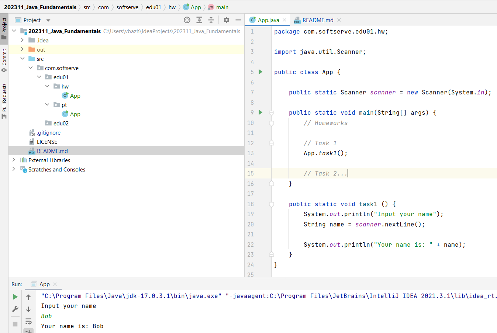

# 202311_Java_Fundamentals
> This is repository of Java Core Complete Course group.

### List of branches

- main - template for new branches;
- dev - examples from trainings;

### Instruction. Create new branch

- create folder on disk
- open cmd and goto to new folder
- clone repository **git clone https://github.com/vasyldmitrovich/202311_Java_Fundamentals.git**
- change directory to **202311_Java_Fundamentals**
- check branch **git branch**
- create new branch **git branch <NAME>** nameBranch
- switch to new branch **git checkout <NAME>** nameBranch
- open project in Idea/Eclipse
- write new code

---
